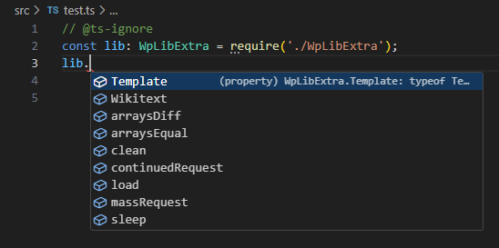

# wp-lib-extra

The source code and TypeScript definitions for [ja:MediaWiki:Gadget-WpLibExtra.js](https://ja.wikipedia.org/wiki/MediaWiki:Gadget-WpLibExtra.js).

This package is distributed for the purposes of providing developers with a development environment to create Wikipedia gadgets/user scripts using this library as a module. (Note that you cannot use the library as a back-end module because it is a front-end program.)

For the functionalities of this library, see the [API documentation](https://dr4goniez.github.io/wp-lib-extra/index.html).

## Usage

To use the type definitions of the library, run:
```bash
npm i -D wp-lib-extra
```
and edit your `tsconfig.json` so that it includes:
```
"include": [
	"./node_modules/wp-lib-extra/types"
]
```
Then, the `WpLibExtra` interface should be available globally:
